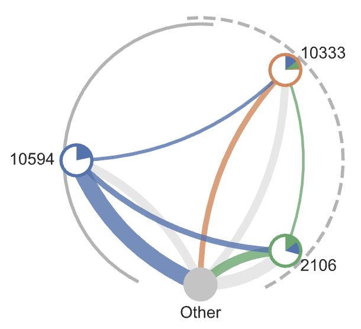
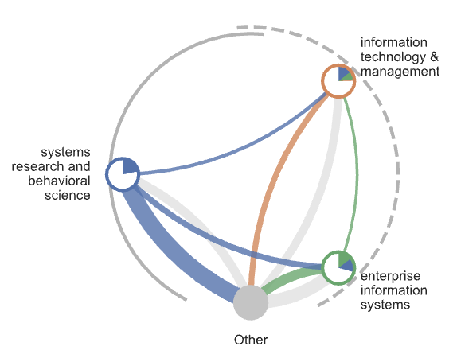

[](https://github.com/skojaku/cidre/actions/workflows/main.yml)
# Python package for the CItation-Donor-REcipient (CIDRE) algorithm

CIDRE is an algorithm to find anomalous groups in directed and weighted networks.
An anomalous group consists of donor and recipient nodes, connected by edges with excessive edge weights (i.e., excessive edges).
A donor is a node providing excessive edges to other member nodes in the same group.
A recipient is a node having excessive edges from other member nodes in the same group.

If you use this package, please cite:

Kojaku, S., Livan, G. & Masuda, N. Detecting anomalous citation groups in journal networks. Sci Rep 11, 14524 (2021). https://doi.org/10.1038/s41598-021-93572-3. 

```latex
@ARTICLE{Kojaku2021,
  title     = "Detecting anomalous citation groups in journal networks",
  author    = "Kojaku, Sadamori and Livan, Giacomo and Masuda, Naoki",
  journal   = "Sci. Rep.",
  publisher = "Nature Publishing Group",
  volume    =  11,
  number    =  1,
  pages     = "1--11",
  month     =  jul,
  year      =  2021,
}


```
## Install


```
pip install cidre
```


*Requirements*
- Python 3.7 or later

## Minimal example 

[**See our notebook for a more detailed example!**](examples/example.ipynb)


```python
import cidre

alg = cidre.Cidre(group_membership)
groups = alg.detect(A, threshold = 0.15)
```

- `group_membership` (*Optional*): If the network has communities, and the communities are not anomalous, tell the communities to CIDRE with this argument. `group_membership` should be numpy.array or list with element, `group_membership[i]`, indicating the group to which node i belongs. Otherwise, set `group_membership=None`.
- `A`: Adjacency matrix of the input network (can be weighted or directed). Should be either an nx.Graph or scipy.sparse_csr_matrix. In case of scipy.sparse_csr_matrix format, A[i,j] indicates the weight of the edge from node i to j.
- `threshold`: Threshold for the donor and recipient nodes. A larger threshold will yield tighter and smaller groups.
- `groups`: List of `Group` instances. See [Group class](#Group-class) section.


## Example


[**Click here to see the step by step guideline of how to use CIDRE**](examples/example.ipynb)


## Group class

`Group` is a dedicated class for groups of donor and recipient nodes.

The donor and recipient nodes of a group, denoted by `group`, can be obtained by
```python
group.donors # {node_id: donor_score}
group.recipients # {node_id: recipient_score}
```

- `group.donors` is a dict object taking keys and values corresponding to the node IDs and the donor scores, respectively.
- `group.recipients` is the analogous dict object for the recipient nodes.

The number of nodes and edges within the group can be obtained by
```python
group.size() # Number of nodes
group.get_within_edges() # Number of edges within this group
```

## Visualization

`cidre` package provides an API to visualize small groups. Before using this API, set up your canvas by
```python
import matplotlib.pyplot as plt

width, height = 7, 10
fig, ax = plt.subplots((width, height))
```

Then, pass `ax` together with `group` that you want to visualize to `DrawGroup` class:
```python
import cidre
dc = cidre.DrawGroup()
dc.draw(group, ax = ax)
```

This will show a plot like this:

<p align="center">

</p>

- The left and right nodes correspond to the donor and recipients nodes, respectively.
- The color of each edge corresponds to the color of the source node (i.e., the node from which the edge emanates).
- The width of each edge is proportional to the weight of the edge.
- The text next to each node corresponds to the ID of the node, or equivalently the row id of the adjacency matrix `A`.

Instead of node IDs, you may want to display the nodes' labels. To do this, prepare a dict object taking IDs and labels as keys and values, respectively, e.g.,

```python
node_labels = {0:"name 1", 1:"name 2"}
```

Then, pass it to the `draw` function as `node_labels` argument, i.e.,
```python
dc.draw(group, node_labels = node_labels, ax = ax)
```

<p align="center">

</p>


